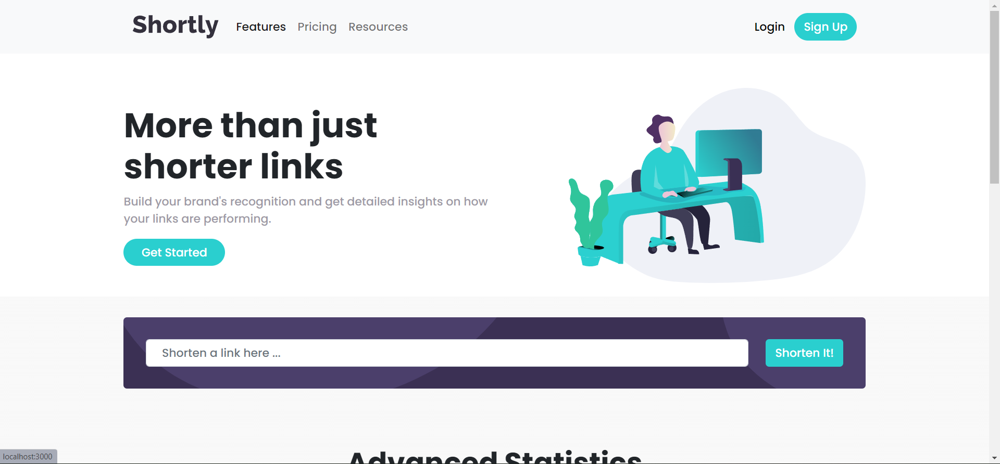
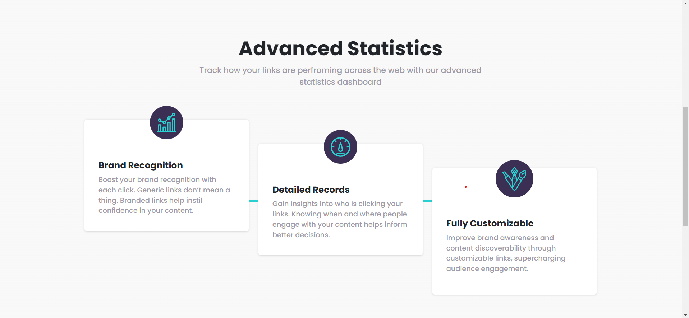
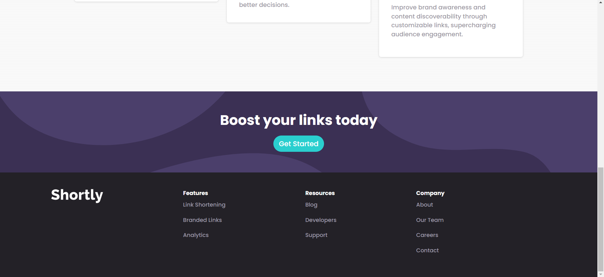
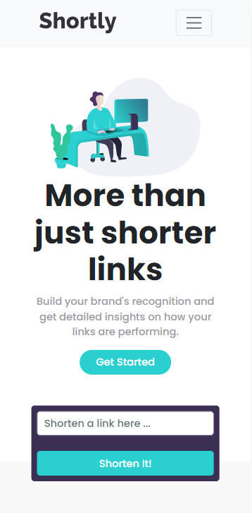
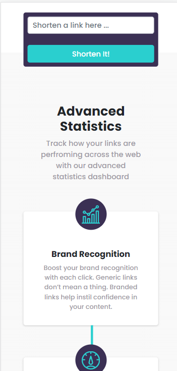
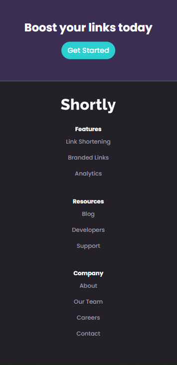

# Frontend Mentor - Shortly URL shortening API Challenge solution

This is a solution to
the [Shortly URL shortening API Challenge challenge on Frontend Mentor](https://www.frontendmentor.io/challenges/url-shortening-api-landing-page-2ce3ob-G)
. Frontend Mentor challenges help you improve your coding skills by building realistic projects.

## Table of contents

- [Overview](#overview)
    - [The challenge](#the-challenge)
    - [Screenshot](#screenshot)
    - [Links](#links)
- [My process](#my-process)
    - [Built with](#built-with)
   
- [Installation](#installation)   
- [Author](#author)
- [Acknowledgments](#acknowledgments)

**Note: Delete this note and update the table of contents based on what sections you keep.**

## Overview

### The challenge

Users should be able to:

- View the optimal layout for the site depending on their device's screen size
- Shorten any valid URL
- See a list of their shortened links, even after refreshing the browser
- Copy the shortened link to their clipboard in a single click
- Receive an error message when the `form` is submitted if:
    - The `input` field is empty

### Screenshot





### Mobile View

<div style="display:flex; gap: 1em; flex-wrap: wrap">



</div>


### Links
- Solution URL: [Github Repo](https://github.com/bbaltuntas/url-shortening)
- Live Site URL: [Live Site - Heroku](https://sheltered-crag-48920.herokuapp.com/)

## My process

### Built with

- Semantic HTML5 markup
- CSS custom properties
- Flexbox
- CSS Grid
- Mobile-first workflow
- [node.js](http://nodejs.org) - for the backend
- [Express](https://expressjs.com) - node.js network framework
- [EJS](https://ejs.co) - node.js template framework
- [jQuery](https://jquery.com/) - For DOM
- [Bootstrap](https://getbootstrap.com/) - The most popular HTML, CSS, and JavaScript framework
- [Google Fonts](https://fonts.google.com) - Beautiful Fonts
- [Font Awesome](https://fontawesome.com/) - Icons


```html
<h1>Some HTML code I'm proud of</h1>
```

```css
.proud-of-this-css {
    color: papayawhip;
}
```

```js
const proudOfThisFunc = () => {
    console.log('🎉')
}
```
#Installation
To run the web app on your local computer you need Node.js to run.
```
cd todolist-v1
npm i
node app.js
```
## Author

- Github - [Bora Barış Altuntaş](https://github.com/bbaltuntas)
